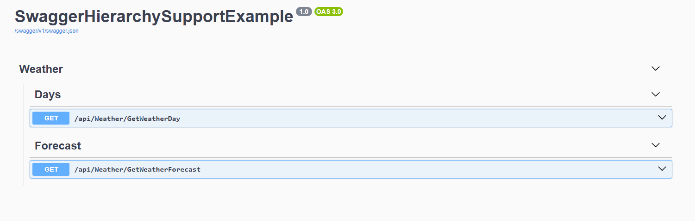

# Swagger Hierarchy Support

A simple extension for **Swashbuckle.AspNetCore 9.x** that adds hierarchical tag support to your Swagger UI using the [swagger-ui-plugin-hierarchical-tags](https://github.com/kael-shipman/swagger-ui-plugins/tree/hierarchical-tags/packages/hierarchical-tags) plugin.

## Installation

1. Add this extension class to your project
2. Ensure you have `Swashbuckle.AspNetCore` version 9.x installed

```xml
<PackageReference Include="Swashbuckle.AspNetCore" Version="9.0.6" />
```

3. Download the [SwaggerUIExtensions.cs](SwaggerUIExtensions.cs) File and add it in ur Project
4. Thtat's it!

## Usage

### 1. Enable the hierarchy support in your Swagger configuration

In your `Program.cs` or `Startup.cs`:

```csharp
app.UseSwagger();
app.UseSwaggerUI(c =>
{
    c.AddHierarchySupport();  // Add this line
});
```

### 2. Tag your controllers with hierarchical tags

Use colons (`:`) to create hierarchy levels:

```csharp
[ApiController]
[Route("/api/[action]")]
public class WeatherController : ControllerBase
{
    [HttpGet]
    [Tags("Weather:Forecast")]  // Parent:Child structure
    public string GetWeatherForecast() { ... }
    
    [HttpGet]
    [Tags("Weather:Days")]
    public string GetWeatherDay() { ... }
}
```

That's it! Your Swagger UI will now display tags in a collapsible hierarchical tree structure.

## Troubleshooting

### 🔍 Hierarchy not showing up?

**1. Clear your browser cache**
- Perform a hard refresh of the page
- This ensures the latest scripts are loaded

**2. Check the browser console**
- Open developer tools (F12)
- Look for any JavaScript errors or warnings
- Verify that the plugin script loads successfully

**3. Verify your tag format**
- Tags must use colons (`:`) to create hierarchy
- Example: `"Weather:Forecast"` or `"Users:Admin:Permissions"`
- Tags without colons will not be grouped hierarchically

**4. Check your configuration**
- Ensure you're using Swashbuckle.AspNetCore 9.x
- Verify `c.AddHierarchySupport();` is called inside `UseSwaggerUI`
- Restart your application after making changes

**5. Network issues**
- The plugin loads from CDN (unpkg.com)
- Check your internet connection
- Verify your firewall doesn't block CDN requests

### 💬 Still having issues?

If none of the above solutions work, please [create an issue](https://github.com/Youngmc117/Swagger_Hierarchy_Support/issues) with:
- Your Swashbuckle.AspNetCore version
- Browser console errors (if any)
- Code snippets of your configuration


## Preview


